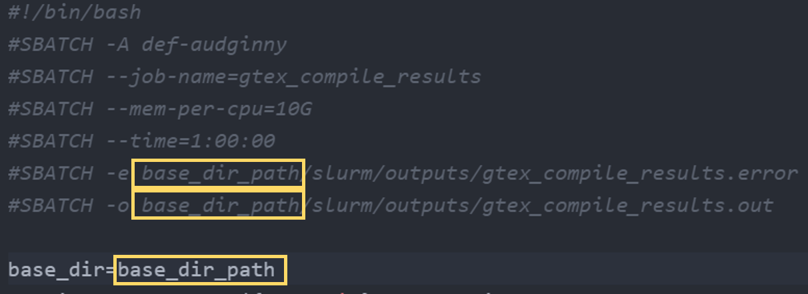

# GTEx - GWAS analysis
## Installation
To install, first clone the repository with:
```bash
git clone https://github.com/maticalderini/GTEx-GWAS.git
```

This will create the directory GTEx-GWAS containing all the required files for anlysis and to download all the necessary raw data EXCEPT for the raw GWAS and risk loci. Placeholder files are located at the *data/raw* subdirectory and should be replaced with the real ones (using the same names).

From there one should follow these steps:
0. Go to the project root directory
```bash
cd GTEx-GWAS
```
1. Add the links to the GTEx tissues on the *data/raw/GTEx_tissues_list.txt* files
2. Run the *src/setup.sh* file to download the required files (plink files, GTEx tissues and the fine-mapping tool [PAINTOR](https://github.com/gkichaev/PAINTOR_V3.0))
```
bash src/setup.sh
```
If one were to need to download new tissues for a new analysis, it suffices to add the new links to *data/raw/GTEx_tissues_list.txt* and download the new tissue files with:
```bash
bash src/get_GTEx_data.sh
```

3. Wait until all the files are downloaded, PAINTOR is installed and the python virtual environment is created (this can take from a few minutes to a few hours depending on the number of tissues used)
4. Once everything is downloaded, two scripts require to change the base path: *src/pipeline.sh* and *src/compile_results.sh*. In both, the base path should be changed in three places (all within the first lines of the script): the paths in the heading corresponding to error and output and the line that says base_dir=base_dir_path. In all three (six) cases, it suffices to replace with the path to the GTEx-GWAS folder created when cloning (using ```pwd```)


5. Once the paths are changed, simply run the pipeline:
```bash
bash src/pipeline.sh
```
This will run the analysis for the GWAS and every tissue (divided into several cell groups) by creating and scheduling a lot of individual, parallel jobs.
6. Once all the jobs are finished (one can use ```sq```) to look at the status of all sent jobs), one can compile the results using:
```bash
bash src/compile_results.sh
```
7. The full compiled results can be found at *data/proc*:
  - tissue_results.txt for the individual tissues
  - gwas_results.txt for the gwas
  - scores.txt for the combined summary of gwas and gtex tissues
  - If LD for any locus should be necessary, it can be found at *data/temp* along with the summary statistics of the locus. The *data/temp* subdirectory contains a lot of intermediary data. It might be useful to delete it if not needed to save space.
